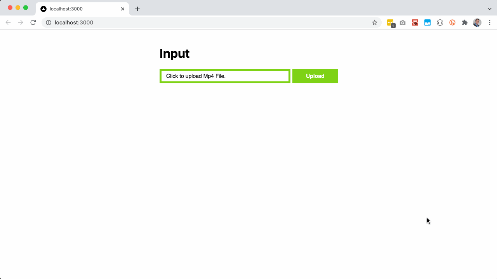

This is a very simple reference application for a distributed application using basic message queuing. 

# Scenario

A user can go to a webapp, upload an `mp4` file and then download the converted `mp3` file. 



# Getting Started

## Quick Demo

```bash
docker-compose -f docker-compose.yml up -d --build
```

Main web app will be available at [`http://localhost:3000`](http://localhost:3000).

## Stateful Services Only

```bash
docker-compose -f docker-compose.dev.yml up -d --build
```

This will not run the `in-house` components. You'll have to configure and run them locally.

## High level overview.

Component | Description | Type | Port | Inhouse | Settings
---|---|---|---|---|---
mongo | Database/Persistence service. | stateful* | `27017` | `no`
mongo-express | Graphical gui to explore `mongo` database. | stateful* | [`8081`](http://localhost:8081) | `no`
rabbitmq | Message Queue | stateful* | `5672` | `no`
s3 (minio) | AWS S3 Compatible File Storage | stateful* | `9000` | `no`
minio-ui | Embedded in `s3`. Graphical tool for exploring `mino`. | stateless | [`9001`](http://localhost:9001)  | `no`
worker | Python3 Script waiting for jobs and managing ffmpeg conversion | stateless | `none`  | `yes` | `./worker/settings/settings.py`
webapp | User interface for uploading mp4 files and downloading of converted mp3. | stateless | `3000`  | `yes` | `./webapp/utils/settings.ts`

## Definitions

1. `in-house` Stuff that we will be working on.
1. `not in-house` - [Us leaning on the shoulder's of giants](https://en.wikipedia.org/wiki/Standing_on_the_shoulders_of_giants).
1. `type` - Type of `stateless` don't persist data for the long term on its own disk/volume. Type of `stateful`, persist data for the long term on its own disk/volume. More [here](https://www.redhat.com/en/topics/cloud-native-apps/stateful-vs-stateless)

# Development Tools

This is handy during development when you only want to Launch the Stateful Components with Docker Compose and then you want to run the `in-house` components of the app using your host machine. This provides a faster development experience.

## NodeJS Version Manager

```bash
curl -fsSL https://fnm.vercel.app/install | bash
fnm install v14.18.1
fnm use v14.18.1
```

## PNPM Node Package Manager

```bash
npm install -g pnpm
```

## Python3

### Check if python3 is present in your system.

```bash
python3 --version
```

```
Python 3.8.11
```

### Check if pip is present in your system.

```bash
python3 -m pip --version
```

```
pip 21.1.1 from /Users/$USER/.pyenv/versions/3.8.11/lib/python3.8/site-packages/pip (python 3.8)
```

### Setup Virtual Environment

Create a virtual environment in a handy folder. Could be root of this project.

```bash
python3 -m venv /path/to/project/root/.venv
```

### Activate Virtual Environment

```bash
source /path/to/project/root/.venv/bin/activate
```

## In-House Components

The following are the `in-house` components of this system:

### Webapp

Install dependencies.

```bash
cd ./webapp
pnpm install
```

Start the dev script on `package.json`

```bash
pnpm dev
```

### worker

Start the worker instance. 

> Make sure you are running bash within virtual environment (venv)!

```bash
cd ./worker
python3 main.py
```